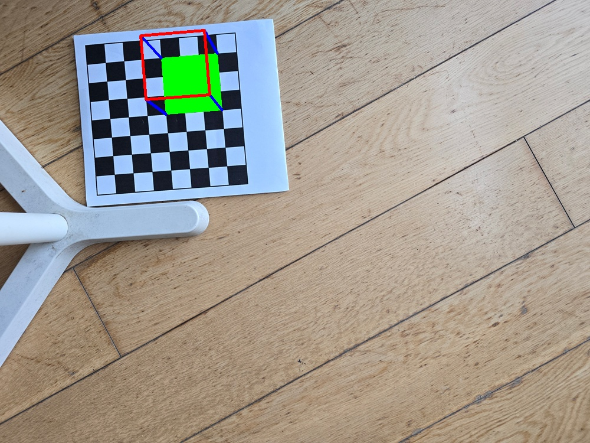

# Camera Calibration &  Pose Estimation 

## Camera Calibration
Camera calibration is performed to determine a camera's intrinsic parameters (focal length, optical center, and lens distortion), as well as the extrinsic parameters (translation vector and rotation matrix). This was done using OpevCV library to enable accurate 3D measurements and computer vision applications.

The process uses multiple images (recommended 10) of a known calibration pattern, such as a chessboard, captured from various angles.
<figure>
    
</figure>

 

## Camera Pose Estimation 
Camera pose estimation is performed to determine the position and orientation of a camera in a 3D space relative to a known object or scene. Using OpenCV, this is often achieved by detecting key points in an image, matching them to a predefined 3D model, and then computing the camera's extrinsic parameters (rotation and translation matrices). Techniques such as solvePnP (Perspective-n-Point) and feature-based matching are commonly used to solve this problem, enabling applications like augmented reality, 3D reconstruction, and robot navigation.
<figure>
    
</figure>
